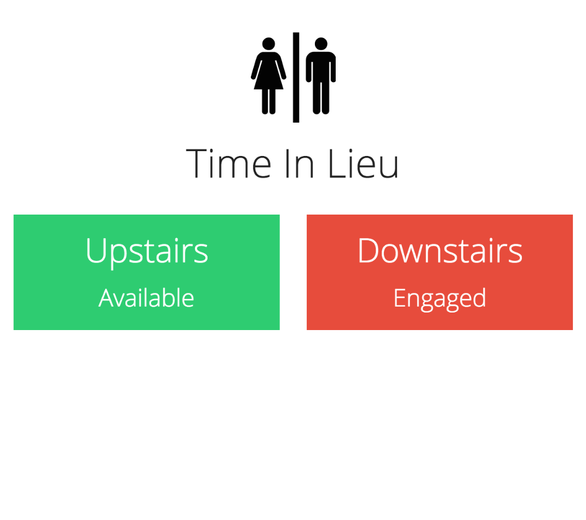

Time in Lieu
============

Status indicator for loos

Requirements
------------

Arduino, RasberryPi, python, redis

Usage
-----
::

$ pip install looserver
$ looserver add <loo_id> "Label for Loo"
$ ./rf24/forwarder &
$ looserver serve
$ python looserver/web/__init__.py

Architecture
------------

Battery powered Arduino, communicating with a RasberryPi over nRF24L01. Pi pushes status onto a Redis queue, monitored by a server that logs events to a database for stats, and pushes change notifications on another Redis queue, used by the webserer to push notifications to browsers using websockets.
